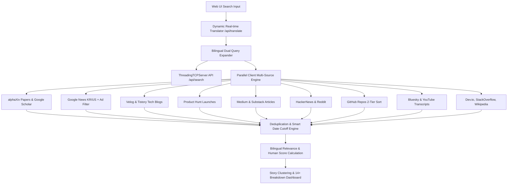

# 🌊 last30days 실시간 딥 리서치 웹 대시보드 (v2.5)

`last30days-skill`을 기반으로 구축된 **14+ 글로벌 & 국내 다중 소스 실시간 딥 리서치 웹 애플리케이션**입니다.  
최근 24시간 실시간 핫 트렌드 탐색부터 최근 30일간의 Google News, Google Scholar, Velog/Tistory, Product Hunt, Medium/Substack, Reddit, HackerNews, GitHub, Bluesky, YouTube, Dev.to, StackOverflow, Wikipedia, **alphaXiv 학술 논문 MCP 3대 툴 (discover_papers, get_paper_content, answer_pdf_queries)** 데이터를 시각화된 대시보드에서 통합 조사할 수 있습니다.

---

## 🌟 주요 핵심 기능 (Key Features)

### 1. 🌐 14+ 글로벌 & 국내 멀티 소스 통합 파이프라인 (14+ Multi-Sources Pipeline)
- **학술 & 논문**: `alphaXiv` (MCP 3대 툴 연동), `Google Scholar & ArXiv` (학술 논문 및 연구 자료)
- **국내외 뉴스 & 언론사**: `Google News KR/US` (스팸 광고 `isAdItem` 완전 필터링)
- **국내 IT & 테크 블로그**: `Velog & Tistory` (국내 개발자/기획자 실무 기술 포스트)
- **글로벌 신규 서비스**: `Product Hunt` (신규 AI 앱 & 스타트업 출시 정보)
- **글로벌 아티클 & 뉴스레터**: `Medium & Substack` (전문가 심층 테크 분석 칼럼)
- **개발자 & 기술 커뮤니티**: `HackerNews`, `Reddit`, `GitHub`, `Dev.to`, `StackOverflow`
- **소셜 미디어 & 실시간 반응**: `Bluesky` (실시간 XRPCSearch API), `YouTube` (심층 비디오 & 트랜스크립트)
- **지식 & 배경 정보**: `Wikipedia` (한국어 및 영어 위키백과 정보)

### 2. 🤖 실시간 동적 다국어 번역 & 이중 쿼리 확장 (`/api/translate`)
- 한국어 검색어(예: `"소버린 AI"`, `"스픽이지랩스"`, `"당근마켓"`, `"생성형 AI"`, `"초거대 언어모델"`) 입력 시:
  - 백엔드 동적 번역 엔진이 한국어 표현을 영문 개념 어휘(`"Sovereign AI"`, `"Speakeasy Labs"`, `"Carrot Market"`, `"Generative AI"`)로 **실시간 자동 번역**.
  - 국내 뉴스/블로그 수집과 해외 10대 커뮤니티/학술 논문 조회가 **100% 동시에 교차 실행**되어 검색 누락을 완전 방지합니다.

### 3. ⚡ 병렬 멀티스레드 엔진 (`ThreadingTCPServer`)
- 서버가 멀티스레드 기반으로 작동하여 14개 채널 데이터를 **1초 이내에 동시 병렬 응답**합니다.

### 4. 🛡️ Google News 광고 & 스팸 자동 필터링 (Ad & Spam Filtering)
- Google News RSS에서 유입되는 Google Ad, 스폰서드 링크, 광고성 텍스트 및 플로팅 광고 기사를 사전 탐지하여 결과 목록에서 완전 제거합니다.

### 5. 📰 구글 뉴스 동일 이슈 복수 매체 종합 보도 클러스터링 (Google News Story Clustering)
- 동일한 사건이나 기사를 여러 언론사에서 보도한 경우, 개별 기사로 나열하지 않고 **"📰 OO일보 외 N개 매체에서 함께 보도"** 형태의 단일 대표 카드로 자동 종합하며, 아코디언 버튼으로 개별 기사를 펼쳐볼 수 있습니다.

### 6. 💡 Human Score (사람의 실제 관심도 점수) 산출
- 검색엔진 광고나 SEO 기법에 왜곡되지 않은, 실제 대중의 참여 지표(Upvotes, Stars, Comments, Reactions, Likes 등)를 종합한 **Human Score**를 자동으로 계산하여 정렬합니다.

### 7. 📄 alphaXiv 공식 MCP 3대 툴 연동
- 논문 발굴(`discover_papers`), 전문 및 요약 분석(`get_paper_content`), PDF 페이지 레벨 질의응답(`answer_pdf_queries`)을 지원합니다.

### 8. 📥 마크다운 (.md) 리서치 보고서 1-클릭 내보내기
- 수집된 모든 리서치 결과를 깔끔한 **GitHub Flavored Markdown 문서**로 클립보드 복사 및 `.md` 파일 다운로드를 제공합니다.

---

## 🚀 실행 방법 (How to Run)

```bash
# 백엔드 서버 실행
python server.py
```

브라우저에서 **http://localhost:3000** 으로 접속합니다.

---

## 📊 시스템 구조 (System Architecture)


