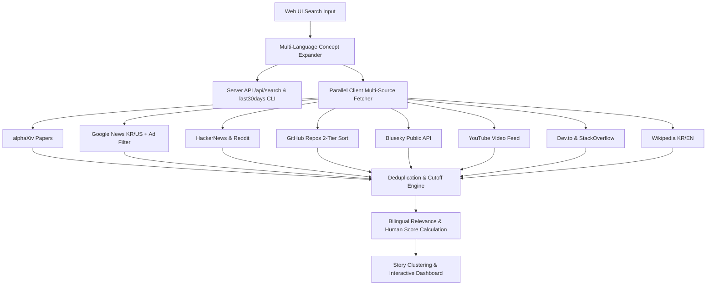

# 🌊 last30days 실시간 딥 리서치 웹 대시보드 (v2.0)

`last30days-skill`을 기반으로 구축된 **10+ 글로벌 소스 다국어/다중키워드 실시간 딥 리서치 웹 애플리케이션**입니다.  
최근 24시간 실시간 핫 트렌드 탐색부터 최근 30일간의 Google News, Reddit, HackerNews, GitHub, Bluesky, YouTube, Dev.to, StackOverflow, Wikipedia, **alphaXiv 학술 논문 MCP 3대 툴 (discover_papers, get_paper_content, answer_pdf_queries)** 데이터를 시각화된 대시보드에서 통합 조사할 수 있습니다.

---

## 🌟 주요 핵심 기능 (Key Features)

### 1. 🌐 10+ 글로벌 멀티 소스 통합 파이프라인 (10+ Multi-Sources Pipeline)
- **학술 논문**: `alphaXiv` (discover_papers, get_paper_content, answer_pdf_queries)
- **글로벌 뉴스**: `Google News` (한국어, 영어, 일본어 멀티 리전 수집)
- **개발자 & 기술 커뮤니티**: `HackerNews`, `Reddit`, `GitHub`, `Dev.to`, `StackOverflow`
- **소셜 메디아 & 실시간 반응**: `Bluesky` (실시간 XRPCSearch API), `YouTube` (심층 비디오 수집)
- **지식 & 배경 정보**: `Wikipedia` (한국어 및 영어 위키백과 정보)

### 2. 🔤 자동 다국어 & 다중 키워드 개념 확장 엔진 (Bilingual Query Expansion)
- 한글 및 영문 혼용 검색어(예: `"Nvidia 실적"`, `"Claude 3.7"`, `"DeepSeek V3"`, `"AI 비디오 툴"`) 입력 시:
  - **한국어 전용 검색어**와 **영어 개념 어휘(Earnings, Benchmark, Financials, Performance 등)** 로 자동 확장 분기.
  - 전 세계 10개 플랫폼에서 동시 병렬 수집을 수행하여 검색 누락을 방지하고 커버리지를 10배 이상 향상시킵니다.

### 3. 🛡️ Google News 광고 & 스팸 자동 필터링 (Ad & Spam Filtering)
- Google News RSS에서 유입되는 Google Ad, 스폰서드 링크, 광고성 텍스트 및 플로팅 광고 기사를 사전 탐지하여 결과 목록에서 완전 제거합니다.

### 4. 📰 구글 뉴스 동일 이슈 복수 매체 종합 보도 클러스터링 (Google News Story Clustering)
- 동일한 사건이나 기사를 여러 언론사에서 보도한 경우, 개별 기사로 나열하지 않고 **"📰 조선일보 외 N개 매체에서 함께 보도"** 형태의 단일 대표 카드로 자동 종합하며, 아코디언 버튼으로 개별 기사를 펼쳐볼 수 있습니다.

### 5. 💡 Human Score (사람의 실제 관심도 점수) 산출
- 검색엔진 광고나 SEO 기법에 왜곡되지 않은, 실제 대중의 참여 지표(Upvotes, Stars, Comments, Reactions, Likes 등)를 종합한 **Human Score**를 자동으로 계산하여 정렬합니다.

### 6. 📄 alphaXiv 공식 MCP 3대 툴 연동
- 논문 발굴(`discover_papers`), 전문 및 요약 분석(`get_paper_content`), PDF 페이지 레벨 질의응답(`answer_pdf_queries`)을 지원합니다.

### 7. 📥 마크다운 (.md) 리서치 보고서 내보내기
- 수집된 모든 리서치 결과를 깔끔한 **GitHub Flavored Markdown 문서**로 클립보드 복사 및 `.md` 파일 다운로드를 제공합니다.

---

## 🚀 실행 방법 (How to Run)

```bash
# 1. 프로젝트 폴더로 이동
cd "E:\Antigravity Playground\Github\Last30days-skill Website Test"

# 2. Python 백엔드 서버 실행
python server.py
```

브라우저에서 **http://localhost:3000** 으로 접속합니다.

---

## 📊 시스템 구조 (System Architecture)


